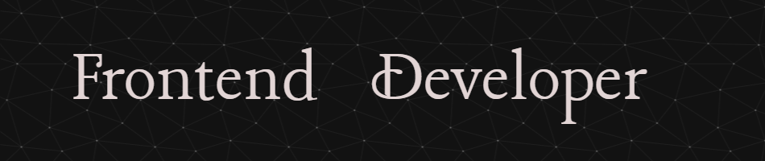

<h1 align="center">Hi 👋, I'm Max Szymański</h1>
<h3 align="center">A passionate Frontend Developer from Poland</h3>

🚀 As a Frontend Developer, I specialize in creating modern, interactive web applications. 
  
💡 I am constantly hungry for knowledge and with great enthusiasm I expand my skills in the field of Frontend Development, discovering newer technologies and tools.
  
⚽ Aside from coding, I am a football fan. I also love cycling and training at the gym, leading an active lifestyle.
  
🔭 I’m currently working on **Burrito Admin**
  
🌱 I’m currently learning **Next.js**
  
📫 If you have any questions, please write **hello@maxszymanski.pl**
  

<h3 align="center"> I'm excited about the opportunities in the world of Frontend Development and ready for new challenges. Thanks for visiting my profile!</h3>
 

<h3 align="left">Languages and Tools:</h3>

   

  

    

  

     

